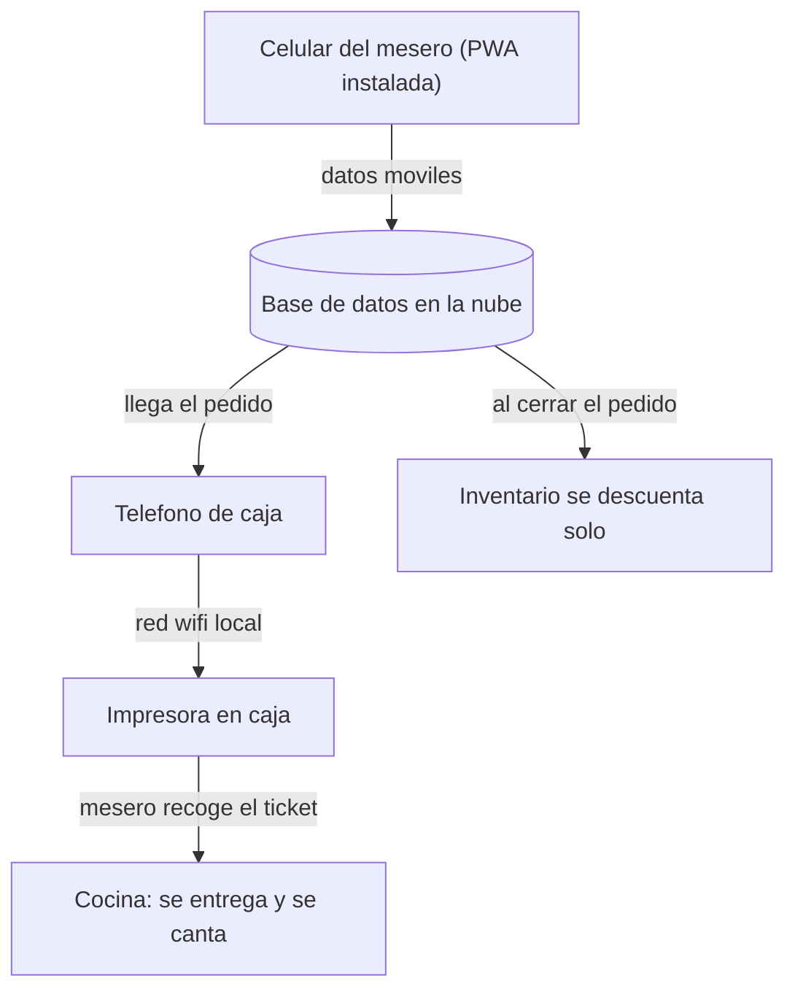
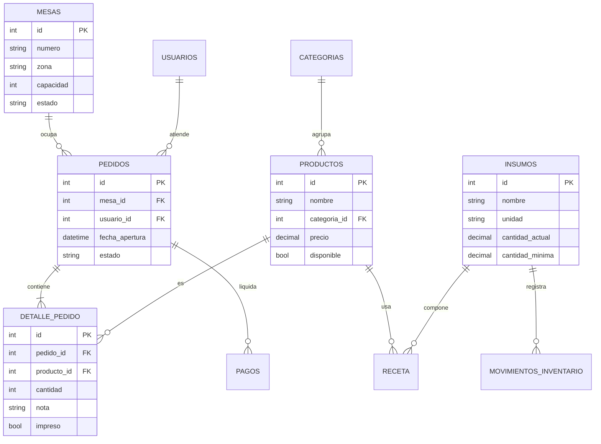
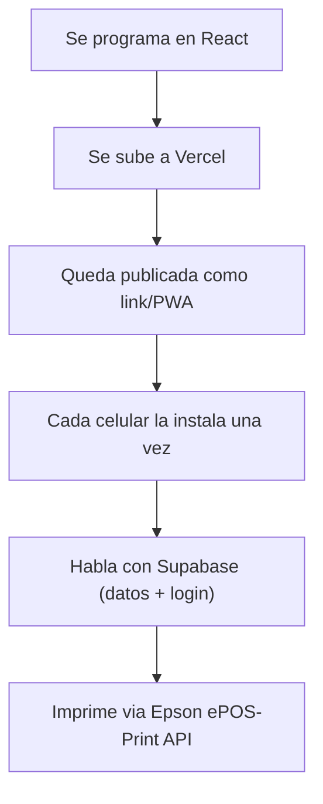

# Arquitectura del sistema del restaurante

Mariscos · asados · arroces · sancochos — de comanda de papel a sistema en la nube

## Resumen de la decisión

La base de datos vive en la **nube** (es la fuente de verdad, con respaldo real). La app es una **página web instalable (PWA)**: cada celular la instala una sola vez y desde entonces abre al instante, incluso sin señal en ese momento. Cada celular usa sus propios datos móviles para enviar y sincronizar los pedidos — nadie depende de un solo teléfono haciendo de hotspot. La impresora sigue conectada a la red WiFi local de caja, porque imprimir es una acción local e instantánea que no debe depender de la nube.

## Página web instalable (PWA), no app de tienda

Para ahorrar costos, la app se construye como **página web instalable**: no hay que publicarla en ninguna tienda de apps, un solo código sirve para todos los celulares. La primera vez que se abre necesita datos móviles (para instalarla, como bajar cualquier app). Después de esa primera vez, el celular ya guardó su propia copia y la abre al instante aunque en ese momento no haya señal — solo necesita señal para **enviar y guardar** el pedido en la nube, no para simplemente abrir la app.

Como aquí todos tienen datos móviles y no es un problema, cada celular sincroniza directo con la nube por su cuenta. Ya no depende de que el teléfono de caja esté prendido para que los demás tengan red.

## Flujo paso a paso

1. **Mesero inicia sesión** en la app con su usuario y contraseña, y toma el pedido: mesa, productos, notas ("sin cebolla", término de la carne, etc.).
2. **El pedido se guarda de inmediato en la nube**, usando los datos móviles del celular. Si en ese punto del local no hay señal, el pedido se guarda en el celular (vía IndexedDB) y la pantalla muestra una alerta visible: "pendiente de sincronizar" — así el mesero sabe que cocina todavía no lo ha visto, y no asume que ya se está preparando.
3. **El teléfono de caja recibe el pedido** y lo manda a imprimir por su red WiFi local. Si la impresora falla o se traba, hay un botón de reimprimir o se puede leer el pedido desde la pantalla y cantarlo directamente.
4. **El mesero camina el ticket a cocina** y lo canta en voz alta — así se evitan errores por letra o por voleo.
5. **Cocina prepara** sin necesitar ningún dispositivo digital.
6. **Al cerrar la mesa**, caja cobra (efectivo, Nequi o datáfono) y se registra el pago contra ese pedido.
7. **El inventario se descuenta solo**: cada producto vendido resta automáticamente los insumos de su receta (ej. un sancocho de pescado resta pescado, papa, yuca, mazorca según lo definido).
8. **Reportes** se consultan desde cualquier celular con acceso, porque viven en la nube — no dependen de estar frente a un aparato específico.

El punto crítico del diseño: el pedido se guarda **antes** de intentar imprimir, no al revés. Así, un atasco de papel nunca significa un pedido perdido — solo significa repetir la impresión o cantarlo de memoria.

## Dónde viven los datos: histórico completo, no borrado

**Corrección sobre la versión anterior de este documento:** se había planteado borrar cada mes viejo de la nube para mantener el costo estable. Eso fue una optimización innecesaria — texto de pedidos durante años pesa apenas unos megabytes en Postgres, no representa un costo real. Borrar esa información le quita al negocio algo valioso: poder comparar, por ejemplo, si se vendió más sancocho esta Semana Santa que la del año pasado.

En vez de borrar, los pedidos viejos se **archivan**: se marcan con una columna \`archivado = true\` (o se mueven a una tabla \`pedidos_historicos\`) para que no estorben en las consultas del día a día, pero siguen ahí, consultables, para siempre. Además, cada mes se sigue generando un Excel de respaldo (ventas, gastos, nómina) como copia adicional fuera de la base de datos.

## Reglas de operación

Dos reglas se vuelven obligatorias con esta arquitectura:

- **El dispositivo de caja debe ser fijo y dedicado** — idealmente una tablet Android económica, montada en un soporte y conectada a la corriente 24/7, en vez de un celular que alguien pueda llevarse o que se quede sin batería. Es el que recibe los pedidos y manda a imprimir; si falla, se corta la impresión aunque los pedidos sigan guardándose en la nube sin problema.
- **Cada persona tiene su propio usuario y contraseña**, no un PIN compartido. Como los datos ya viven en internet (aunque sea dentro de tu propia cuenta en la nube), hace falta un control real de quién entra, para saber quién tomó cada pedido y proteger la información del negocio.

## Modelo de datos

Diez entidades cubren todo el flujo: mesas, personal, menú, inventario y ventas.

### Detalle de cada tabla

| mesas | campo | uso |
| --- | --- | --- |
| id | PK | identificador |
|  | numero, zona | salón, terraza, barra |
|  | capacidad, estado | libre / ocupada |

| usuarios | campo | uso |
| --- | --- | --- |
| id | PK | identificador |
|  | nombre, rol | mesero, cajero, admin |
|  | usuario, contraseña | login individual, obligatorio por seguridad |

| categorias / productos | campo | uso |
| --- | --- | --- |
| categorias | nombre | mariscos, asados, arroces, sancochos, bebidas |
| productos | nombre, categoria_id, precio, disponible | ítem vendible del menú |

| insumos / receta | campo | uso |
| --- | --- | --- |
| insumos | nombre, unidad, cantidad_actual, cantidad_minima, costo_unitario | camarón, pescado, arroz, carne, coco... |
| receta | producto_id, insumo_id, cantidad_usada | cuánto insumo gasta cada plato vendido |

El descuento automático por receta es un **estimado**, no la realidad exacta — mermas, porciones irregulares e ingredientes dañados hacen que se desfase con el tiempo. Por eso la app debe tener una pantalla de **cuadre de inventario** (idealmente semanal) donde alguien cuenta lo que hay físicamente y ajusta la cantidad en el sistema, usando el tipo "ajuste" ya previsto en \`movimientos_inventario\`. La fuente de verdad a fin de mes es la nevera, no la base de datos.

| pedidos / detalle | campo | uso |
| --- | --- | --- |
| pedidos | mesa_id, usuario_id, fecha, estado | abierto, cerrado, cancelado |
| detalle_pedido | producto_id, cantidad, nota, impreso | cada línea del pedido |

| pagos / movimientos | campo | uso |
| --- | --- | --- |
| pagos | pedido_id, metodo, monto, fecha | efectivo, Nequi, datáfono |
| movimientos_inventario | insumo_id, tipo, cantidad, fecha, pedido_id | salida por venta, entrada por compra, merma |

## Manejo de fallas

Pedido guardado ≠ pedido impreso — son dos pasos separados a propósito. Si la impresora se atasca o se queda sin papel, el pedido ya existe en la base de datos: solo se reintenta imprimir o se canta de la pantalla. Papel térmico de buena calidad y limpieza periódica del cabezal reducen los atascos por causa mecánica.

## Qué estamos construyendo

Una sola aplicación web, instalable como PWA, que sirve tanto para el mesero como para caja (cambia lo que se ve según el usuario que inicia sesión). Esa app guarda y lee todo de una base de datos en la nube, funciona aunque no haya señal en el momento gracias al navegador, y manda a imprimir directo a la impresora por la red local de caja. No hay servidor propio que mantener, no hay apps separadas por sistema operativo, y no hay instalación manual en cada celular más allá de abrir un link una vez.

## Stack técnico completo

| Capa | Tecnología | Por qué |
| --- | --- | --- |
| Frontend | React (como PWA) | Un solo código corre en cualquier celular desde el navegador; comunidad enorme de desarrolladores si hay que contratar a futuro |
| Modo sin señal | Service Worker + IndexedDB | Son parte del navegador mismo (no es una librería externa): guardan la app y los pedidos pendientes en el celular cuando no hay datos móviles, y sincronizan solos al volver la señal |
| Base de datos | Supabase (Postgres) | Postgres es el estándar relacional, calza exacto con las 10 tablas del modelo de datos; Supabase le suma login y tiempo real ya resueltos |
| Autenticación | Supabase Auth | Usuario y contraseña por persona, roles (mesero, cajero, admin) sin programarlo desde cero |
| Hosting | Vercel (o Cloudflare Pages) | Publica la app en segundos, carga rápido en cualquier parte, escala solo sin tocar nada |
| Impresión | Epson ePOS-Print API (JS) | Imprime directo desde el navegador a la impresora por la red local de caja, sin drivers ni apps intermedias |

### Por qué Supabase y no otra cosa

Supabase no es una base de datos propia inventada: es Postgres estándar con login y tiempo real ya resueltos encima. Eso importa para el día de mañana — si algún día Supabase como servicio deja de convenir, la base de datos se lleva completa a cualquier otro proveedor Postgres, sin rediseñar nada.

| Opción | Esfuerzo hoy | Riesgo a gran escala |
| --- | --- | --- |
| Supabase | Bajo — login y tiempo real incluidos | Bajo — es Postgres, se migra sin reescribir si hace falta |
| Firebase | Bajo también | Medio-alto — formato propio, no relacional; migrar después cuesta más |
| Backend propio | Alto — todo se programa desde cero | Bajo, pero con mucho más tiempo y costo desde el día 1 |

La velocidad del sistema no depende de que los pedidos sean "solo texto" — depende de cuántas operaciones por segundo soporta la base de datos. Postgres está sobradamente probado para mover muchísimo más volumen del que un restaurante (o cientos) generará. El verdadero cuello de botella de este tipo de sistema casi siempre es la impresora física, no la base de datos.

### Seguridad desde el día 1: Row Level Security (RLS)

La seguridad no debe depender solo de lo que la app oculte en pantalla — un mesero con conocimientos técnicos podría intentar saltarse el frontend. Por eso, desde el primer día se configuran políticas de **RLS en Postgres** (incluidas en Supabase) para que, por ejemplo, un usuario con rol "mesero" no pueda editar la tabla de pagos ni modificar un pedido que ya quedó en estado "cerrado" — sin importar qué intente hacer desde la app. La base de datos protege la regla, no solo la interfaz.

## Secuencia de implementación

El orden importa: primero la base de datos, luego el frontend, al final la impresora — así no se rehacen pantallas porque el modelo cambió a mitad de camino.

### Fase 1 — Base de datos y seguridad (Supabase)

1. **Esquema y relaciones:** crear el proyecto y las 10 tablas con sus llaves foráneas. En vez de permitir borrar productos del menú (lo que complica las relaciones con pedidos viejos), los productos nunca se borran — solo se marcan \`disponible = false\`. Así el historial y los precios de ventas pasadas quedan intactos aunque el plato salga del menú o cambie de precio.
2. **Políticas RLS:** definir los roles (admin, cajero, mesero) usando **\`app_metadata\`** de Supabase Auth — no \`user_metadata\`. Esto es crítico: \`user_metadata\` lo puede editar el propio usuario desde el cliente, así que un mesero podría auto-asignarse "admin" si el rol vive ahí por error. \`app_metadata\` solo lo edita el backend. Con el rol bien ubicado, se crean las políticas: un mesero puede \`INSERT\` en pedidos y detalle, pero solo el cajero puede hacer \`UPDATE\` sobre pagos.
3. **Datos de prueba:** insertar mesas, categorías, un par de platos y usuarios de prueba, para armar el frontend contra datos reales en vez de imaginar cómo se verán.

### Fase 2 — Frontend

1. **Estructura:** vistas separadas para \`/mesero\`, \`/caja\` y \`/cocina\` (si en algún momento se agrega pantalla en cocina). React con \`react-router\` o Next.js, ambos válidos — Next.js aporta piezas (servidor, rutas API) que esta app no necesita, así que es una elección de preferencia, no una obligación técnica.
2. **Configuración PWA:** un plugin como \`vite-plugin-pwa\` genera el \`manifest.json\` y el Service Worker que cachea la interfaz.
3. **El motor offline:** la librería \`idb\` (wrapper ligero de IndexedDB). Al presionar "Enviar", el código intenta guardar en Supabase; si falla por red, guarda el pedido en IndexedDB y la UI muestra "pendiente de sincronizar".
4. **Sincronización automática:** un listener (\`window.addEventListener('online', ...)\`) que revisa IndexedDB y reenvía la cola de pedidos pendientes apenas vuelve la señal.

### Fase 3 — Conexión de la impresora (el punto más delicado)

Aquí está el obstáculo técnico donde más se traban estos proyectos: la PWA vive en \`https://\` (Vercel), pero la impresora en la red local tiene una IP tipo \`192.168.1.50\` en \`http://\`. Los navegadores modernos bloquean por seguridad que una página HTTPS le hable directo a algo HTTP — esto se llama **Mixed Content**, y falla en silencio si no se sabe que existe esta regla.

**Solución recomendada — proxy local en la tablet de caja:** en vez de que la página web le hable directo a la impresora, se instala un pequeño programa nativo (no la página web, un programa aparte) en la tablet de caja. Ese programa escucha los pedidos nuevos vía Supabase Realtime y dispara la impresión por HTTP local él mismo. Como es una app nativa y no una página web, no está sujeta a la regla de Mixed Content del navegador. Es el mismo patrón que usan sistemas comerciales como Toast o Square, y evita tener que gestionar certificados SSL autofirmados en la impresora (la alternativa existe, pero es mantenimiento recurrente para algo que debería ser invisible).

## Próximos pasos

Comprar la impresora (Epson TM-m30III u otra con WiFi y ePOS-Print), crear el proyecto en Supabase siguiendo la Fase 1, y armar las primeras pantallas (mesas, toma de pedido, caja) en paralelo.